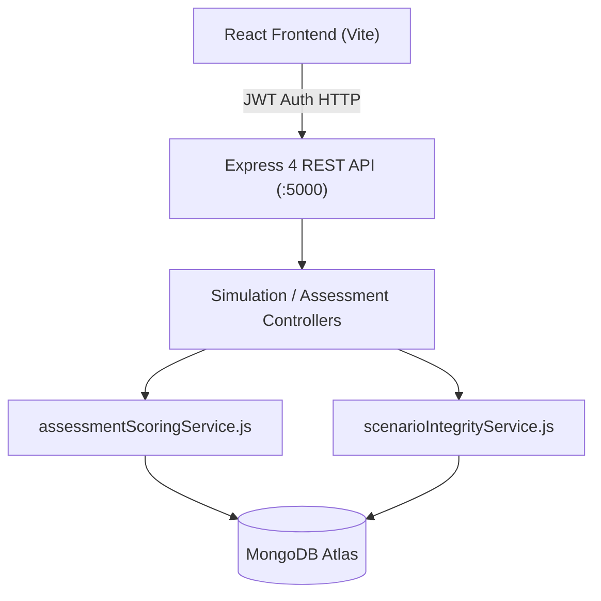

# System Architecture

## Architecture Overview
The Cyber Law Awareness Portal is an academic, full-stack educational and diagnostic platform designed to evaluate and enhance digital security behavior and legal awareness under Indian Cyber Law (IT Act 2000 / BNS).

## Core Subsystems

### 1. Authoritative Assessment & Scoring Engine
- **File**: `server/services/assessmentScoringService.js`
- **Design**: Strict server-side authoritative state machine.
- **Model**: Six-Metric Psychometric & Behavioral Matrix:
  1. `TR` — Threat Recognition (raw points / max opportunities)
  2. `SI` — Signal Identification (raw points / max opportunities)
  3. `VB` — Verification Behavior (graded 0=none, 1=partial, 2=strong)
  4. `DQ` — Decision Quality (overall judgment quality across all situations)
  5. `FP` — False Positive Tendency (penalty deduction for over-reporting legitimate stimuli)
  6. `UA` — Unreviewed Acceptance (penalty deduction for autopilot clicking or credential exposure)
- **Path-Dependent Opportunity Normalization**: Each stage awards or penalizes metrics dynamically depending on traversal choices. Denominators reflect the exact path traversed by the user.

### 2. Scenario Graph & Versioning Subsystem
- **Files**: `server/models/Scenario.js`, `ScenarioStage.js`, `ScenarioDecision.js`
- **Integrity Service**: `server/services/scenarioIntegrityService.js`
- **Immutability Guarantee**: Versioned scenarios (v1 historical, v2 active production). Historical completed sessions permanently reference immutable v1 records. Version 2 graphs handle modern adaptive branching.
- **Topological Invariant**: Any single traversal is exactly 13 active stages. Stage 7 branches to mutually exclusive nodes:
  - Stage 8A (Safe Path, `stageOrder: 8`)
  - Stage 8B (Risky Phishing Path, `stageOrder: 9`)
  Both paths converge at Stage 10 (`stageOrder: 10`) and conclude at Stage 14 (`stageOrder: 14`, Evening Wrap-up reflection).

### 3. Replay Protection & CAS Concurrency
- **File**: `server/controllers/simulationController.js`
- **Mechanism**: Atomic `AssessmentSession.findOneAndUpdate` verifying `{ _id: sessionId, status: 'in-progress', currentStageId: stageId }`.
- **Compound Unique Index**: `AssessmentDecision` enforces `{ assessmentSessionId: 1, stageId: 1 }` to prevent double-click race conditions and replay attacks.
